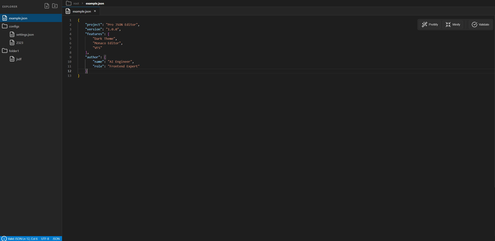

# JSON EDITOR: Editor, Validator & Explorer

**JSON EDITOR** — это легковесный, быстрый и мощный веб-инструмент для работы с файлами JSON. Приложение объединяет в себе функции текстового редактора, автоматического валидатора и интерактивного проводника по структуре данных.

Проект разработан на 100% с использованием нейросети **ZAI** (модель `glm.51`).

## 📸 Скриншот интерфейса

## 🚀 Основные возможности

* **Редактор Monaco** — полноценное редактирование кода с возможностями VS Code (подсветка, автодополнение, форматирование).
* **Валидатор на лету** — автоматическая проверка синтаксиса JSON с мгновенным подсвечиванием строк, содержащих ошибки.
* **Интерактивный эксплорер** — древовидный просмотр структуры (Tree View) для удобного сворачивания и разворачивания объектов и массивов.
* **Удобный проводник** — встроенный менеджер для быстрого переключения между несколькими JSON-файлами в рабочем пространстве.
* **Без лишних зависимостей** — максимальная производительность благодаря отсутствию тяжелых фронтенд-фреймворков.

## 🛠 Технологический стек

* **AI Генерация:** ZAI (`glm.51`)
* **Основа:** Чистый HTML5 / Vanilla JavaScript / Нативный CSS3
* **Ядро редактора:** [Monaco Editor](https://github.io)

## 📦 Быстрый старт

Проект не требует сложной сборки и готов к работе прямо из коробки.

### Запуск приложения

Просто откройте файл `index.html` в любом современном браузере. 

## 📄 Лицензия

Этот проект распространяется под лицензией MIT. Подробности в файле [LICENSE](LICENSE).
